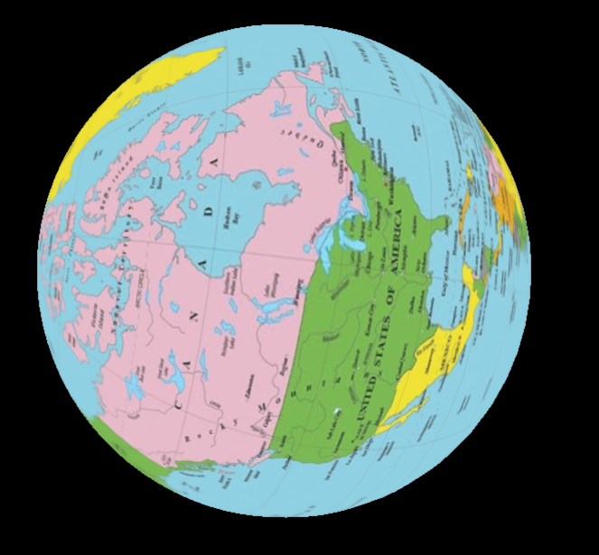
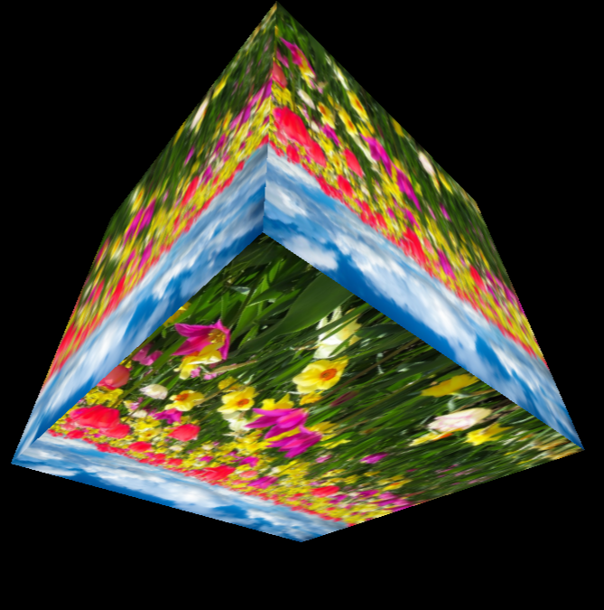
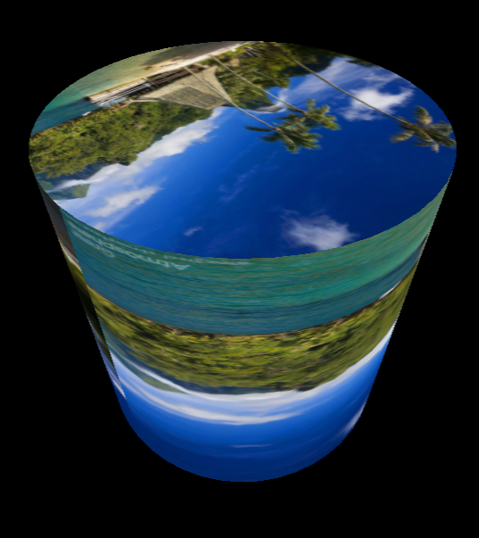
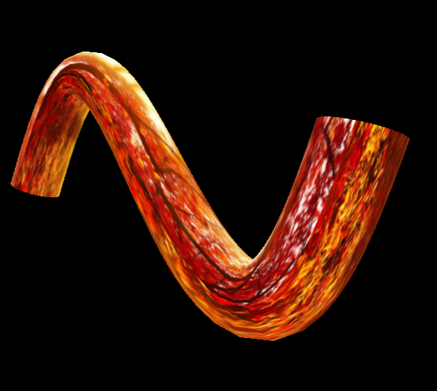
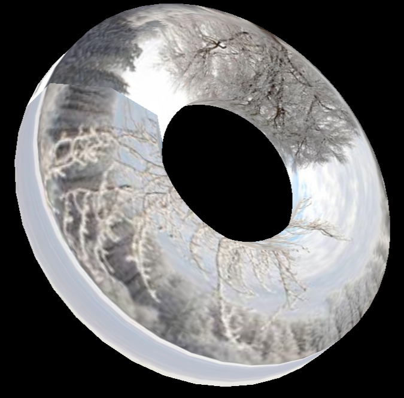

# Threejs Effects!
This project allows users to experiment with projecting any image they choose on a variety of 3D objects. It allows the user to observe and interact with the results of such projections.








This project was bootstrappted by [Create React App](https://github.com/facebook/create-react-app), refer to [README-create-react-app](./README.create-react-app.md) for more info

# Scripts
Run the app locally<br>
```npm start```<br>


```npm run build```

# References
[1] [Create React App](https://github.com/facebook/create-react-app)
